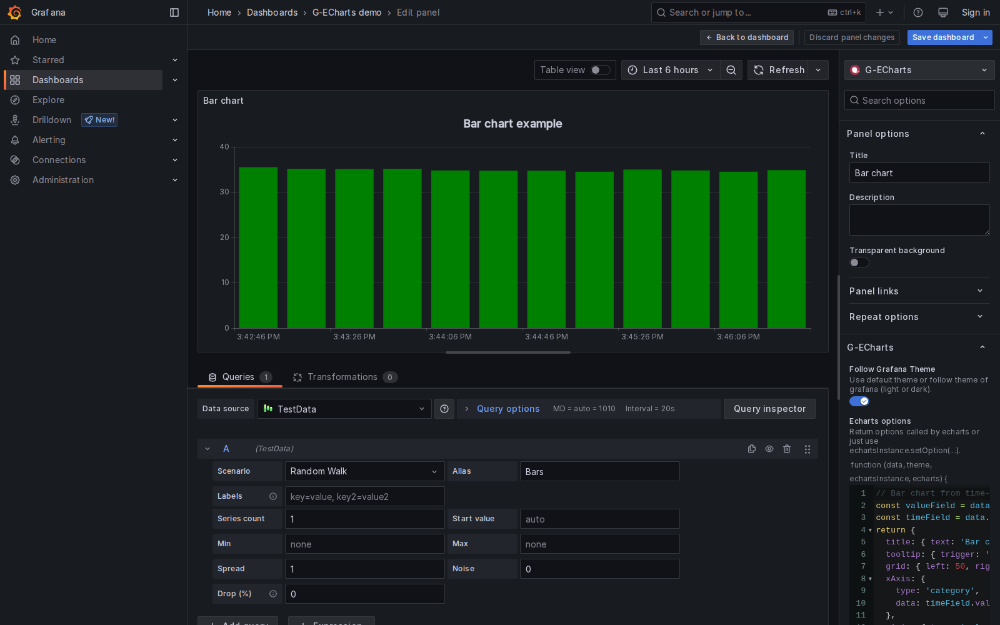
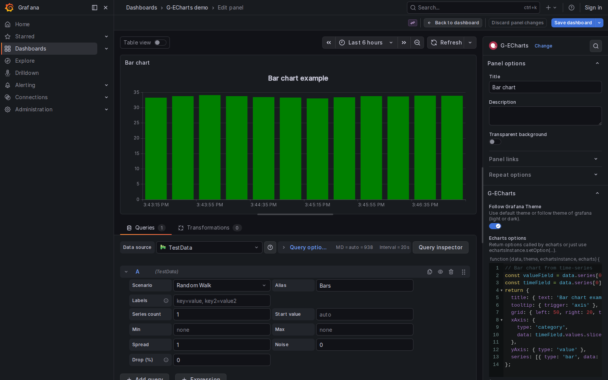
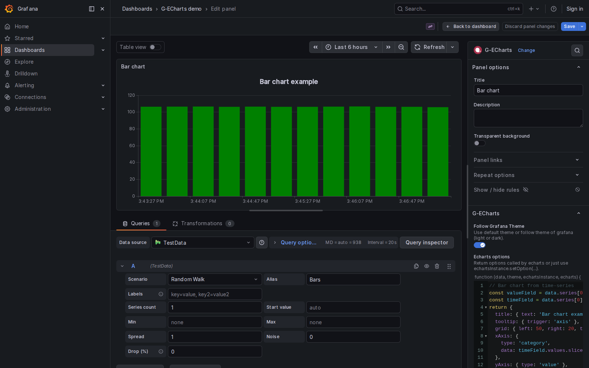

# G-ECharts — an Apache ECharts™ panel for Grafana

> **A maintained fork of [bilibala-echarts-panel](https://github.com/Billiballa/bilibala-echarts-panel) by [@Billiballa](https://github.com/Billiballa).**
> All credit for the original plugin design, panel UX, and the
> `(data, theme, echartsInstance, echarts)` function-body API goes to
> Billiballa. This fork modernizes the build for Grafana 11–13 while
> preserving Billiballa's user-facing contract verbatim, so existing
> dashboards keep rendering without edits.


## Origin & credits

This plugin is a fork of [Billiballa/bilibala-echarts-panel](https://github.com/Billiballa/bilibala-echarts-panel) (Apache-2.0). **Billiballa** designed and shipped the original Grafana ECharts panel — the panel-options code editor, the `(data, theme, echartsInstance, echarts)` signature, the auto-registered map directory, and the default chart all originate from that work. Please give the upstream repo a star if you find this fork useful.

This fork's contribution is limited to:

- modernizing the build (drop `@grafana/toolkit`, move to `@grafana/create-plugin`, Webpack 5, SWC, Jest 29, React 18, Node 24);
- making the user-facing API survive the modernization via a transparent compatibility shim (`src/compat.ts`) so `theme.type` and `field.values.buffer` keep working;
- making charts inherit Grafana's full theme palette via a derived ECharts theme (`src/grafanaTheme.ts`);
- declaring `aliasIDs: ["bilibala-echarts-panel"]` in `plugin.json` so existing dashboards resolve transparently to this plugin.

## Compatibility

The CI gate runs `@grafana/plugin-validator`, type-check, unit tests, and a smoke load against Grafana **11.6.14**, **12.4.3**, and **13.0.1**. Each panel-edit screenshot below is captured live from a fresh Grafana container of that version against the dashboard at `scripts/dashboards/g-echarts-demo.json` and the same `dist/` artifact that's published in the GitHub Release.

### Grafana 11.6.14



### Grafana 12.4.3



### Grafana 13.0.1



To reproduce the captures locally:

```sh
npm run build
PLAYWRIGHT_BROWSERS_PATH=$HOME/.cache/ms-playwright \
  python3 scripts/capture-screenshots.py
```

## Install

The Grafana plugin id is `g-echarts`. The plugin is **not** in the official Grafana catalog (the `grafana-` prefix is reserved by Grafana Labs for first-party plugins, so even a fork named `grafana-echarts` would be rejected; this fork picked the short brandable id `g-echarts` and distributes via GitHub Releases).

**Requires Grafana >= 11.** (Grafana 10 is EOL and rejects the `aliasIDs` field that powers transparent dashboard migration; users on 10.x can stay on the upstream `bilibala-echarts-panel` until they upgrade.)

### Pick an ECharts variant

Each tagged release ships **two signed zips** corresponding to the bundled ECharts major. Both share the same plugin id, the same `plugin.json` schema, and the same `aliasIDs`, so dashboards are interchangeable across variants — but **user-authored `getOption` code can break** at the v4 → v5 boundary (e.g. `series[].lineStyle.normal` was removed in v5). Pick the variant that matches your existing chart code; switching later is a re-install.

| Bundled ECharts | Asset | Best for |
|---|---|---|
| 4.9 (default) | `g-echarts-2.5.0-echarts4.zip` | Direct upgrade from upstream `bilibala-echarts-panel`; existing v8.5.x dashboards |
| 5.x           | `g-echarts-2.5.0-echarts5.zip` | New panels, modern ECharts API |

ECharts 6 is intentionally not bundled — at the time of release the add-on ecosystem (`echarts-gl`, `echarts-liquidfill`, `echarts-wordcloud`) had not yet shipped v6-compatible majors.

### Required Grafana setting

The plugin is community-tier signed (not catalog-signed); allow it explicitly:

```ini
# grafana.ini
[plugins]
allow_loading_unsigned_plugins = g-echarts
```

### Path A — `grafana-cli` (simplest)

```sh
grafana-cli --pluginUrl https://github.com/jakobgabriel/bilibala-echarts-panel/releases/download/v2.5.0/g-echarts-2.5.0-echarts4.zip plugins install g-echarts
sudo systemctl restart grafana-server
```

Verify the SHA256 first (each release also publishes `<asset>.sha256`):

```sh
curl -sLO https://github.com/jakobgabriel/bilibala-echarts-panel/releases/download/v2.5.0/g-echarts-2.5.0-echarts4.zip
curl -sLO https://github.com/jakobgabriel/bilibala-echarts-panel/releases/download/v2.5.0/g-echarts-2.5.0-echarts4.zip.sha256
sha256sum -c g-echarts-2.5.0-echarts4.zip.sha256
```

### Path B — manual unzip (no tooling)

```sh
curl -sLO https://github.com/jakobgabriel/bilibala-echarts-panel/releases/download/v2.5.0/g-echarts-2.5.0-echarts4.zip
sudo unzip -o g-echarts-2.5.0-echarts4.zip -d /var/lib/grafana/plugins/
sudo systemctl restart grafana-server
```

The zip extracts as `g-echarts/` so the final plugin path is `/var/lib/grafana/plugins/g-echarts/`.

### Path C — Docker bind mount (dev / CI)

```sh
docker run -d -p 3000:3000 \
  -v /path/to/g-echarts:/var/lib/grafana/plugins/g-echarts:ro \
  -e GF_PLUGINS_ALLOW_LOADING_UNSIGNED_PLUGINS=g-echarts \
  grafana/grafana:13.0.1
```

This is the path `scripts/capture-screenshots.py` uses; the plugin is loaded from the host filesystem, so iteration is `npm run build` (or `scripts/build-variant.sh 5`) → restart container.

## Migrating from `bilibala-echarts-panel`

If you have dashboards from a Grafana 8.5.x instance that used Billiballa's original `bilibala-echarts-panel`, **no manual edit is needed on Grafana 11+**. This plugin declares `aliasIDs: ["bilibala-echarts-panel", "grafana-echarts"]` in its `plugin.json`, so Grafana transparently resolves panels with the legacy `"type": "bilibala-echarts-panel"` to `g-echarts`. The stored panel options (`followTheme`, `getOption`, …) deserialize cleanly into the modern `SimpleOptions` shape (asserted by `src/migration.test.ts`).

The variant zip you pick at install time decides which ECharts major your charts run against. The default `g-echarts-*-echarts4.zip` ships ECharts 4.9 — the same major upstream `bilibala-echarts-panel` shipped — so any `getOption` code from a Grafana 8.5.x dashboard runs unchanged. If you switch to the `-echarts5.zip` variant and your chart used the legacy `series[].lineStyle.normal` / `series[].itemStyle.normal` syntax (deprecated in ECharts 4, removed in 5), flatten it: `series[].lineStyle` / `series[].itemStyle`.

## Usage

### 1. Add the panel to a dashboard

Open a dashboard → **Add panel** → search for **G-ECharts**. The default chart (Billiballa's original area-line example) renders immediately from any time-series query, with no edits required.

### 2. Edit the chart options

The **Echarts options** editor in the panel options pane is the function body of `(data, theme, echartsInstance, echarts) => { ... }`. The function must `return` an [ECharts option object](https://echarts.apache.org/option.html). `data.series[i].fields[j].values` is a plain array; legacy `.values.buffer` access is also supported via the compat shim (`src/compat.ts`).

See the [Compatibility](#compatibility) section above for what the panel-edit view looks like on each supported Grafana major.

### 3. Worked examples

#### Bar chart from a single time-series query

```js
const valueField = data.series[0].fields.find((f) => f.type === 'number');
const timeField  = data.series[0].fields.find((f) => f.type === 'time');
return {
  xAxis: {
    type: 'category',
    data: timeField.values.map((t) => new Date(t).toLocaleTimeString()),
  },
  yAxis: { type: 'value' },
  series: [{ type: 'bar', data: valueField.values }],
};
```

#### Pie chart aggregated across series

```js
return {
  tooltip: { trigger: 'item' },
  legend: { bottom: 0 },
  series: [
    {
      type: 'pie',
      radius: '70%',
      data: data.series.map((s) => ({
        name: s.name,
        value: s.fields
          .find((f) => f.type === 'number')
          .values.reduce((a, b) => a + b, 0),
      })),
    },
  ],
};
```

#### Heatmap from a multi-series time query

```js
const points = [];
data.series.forEach((s, y) => {
  const valueField = s.fields.find((f) => f.type === 'number');
  valueField.values.forEach((v, x) => points.push([x, y, v]));
});
return {
  xAxis: { type: 'category', data: data.series[0].fields.find((f) => f.type === 'time').values },
  yAxis: { type: 'category', data: data.series.map((s) => s.name) },
  visualMap: { min: 0, max: 100, calculable: true, orient: 'horizontal', bottom: 0 },
  series: [{ type: 'heatmap', data: points }],
};
```

### 4. Follow Grafana theme

Toggle **Follow Grafana Theme** in the panel options. The chart inherits Grafana's full theme palette: series colors come from `theme.visualization.palette`; text, tooltip, axis, and grid-line colors come from `theme.colors.*` and `theme.typography`. Custom themes shipped in newer Grafana versions (e.g. high-contrast) are picked up automatically.

### 5. Side effects (event listeners, intervals)

The function body re-runs every time data refreshes. Clear side effects on each invocation, otherwise listeners will stack:

```js
echartsInstance.off('click');
echartsInstance.on('click', (params) => {
  console.log('Clicked:', params);
});
return { /* … */ };
```

### 6. Custom maps

Drop `YourMap.json` into `src/map/`, run `npm run build`, and the panel auto-registers it via `echarts.registerMap('YourMap', …)`. Reference it in your chart with `geo: { map: 'YourMap' }`. (The auto-registration loop at `src/SimplePanel.tsx:14-25` is Billiballa's original — unchanged in this fork.)

## Develop

```sh
nvm use            # Node 24
npm install
npm run dev        # webpack watch
npm run server     # docker compose up grafana with the plugin mounted
npm run test:ci    # 19 unit tests across compat / grafanaTheme / migration
npm run typecheck
npm run lint
npm run build
```

## Trademarks

Powered by **Apache ECharts™**, a trademark of The Apache Software Foundation.

This project is not affiliated with, endorsed by, or sponsored by The Apache Software Foundation, Apache ECharts, or Grafana Labs.

## License

Apache-2.0. The original `LICENSE` from [Billiballa/bilibala-echarts-panel](https://github.com/Billiballa/bilibala-echarts-panel) is preserved unchanged in this repo.
